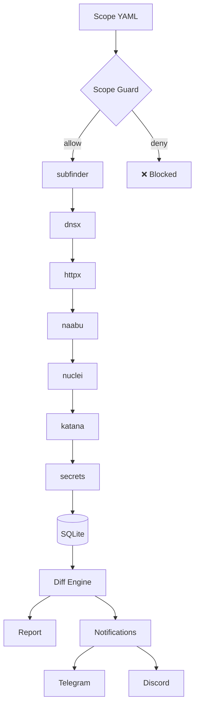

# 🎯 bountyhunt — Bug Bounty Recon & Orchestration

[](https://pypi.org/project/bounthunt/)
[](https://pypi.org/project/bounthunt/)
[](https://opensource.org/licenses/MIT)
[](https://github.com/bess1lie/bounthunt/actions)
[](https://github.com/bess1lie/bounthunt)
[](https://github.com/psf/black)
[](https://github.com/python/mypy)
[](https://github.com/PyCQA/bandit)
[](https://github.com/bess1lie/bounthunt/stargazers)
[](https://github.com/bess1lie/bounthunt/issues)
[](https://github.com/bess1lie/bounthunt/pulls)

**Scope-aware recon orchestration for bug bounty programs.**  
*Orchestrate · Monitor · Report — without ever leaving scope.*

---

## 🚀 Demo

```bash
$ bountyhunt monitor scope.yaml

🔄 Starting monitoring loop...
[INFO] Checking scope.yaml...
[INFO] Scan completed. 12 new hosts discovered.
[INFO] 2 new endpoints found on example.com
[INFO] 1 new vulnerability found via nuclei
[SUCCESS] Sending notification to Telegram...

$ bountyhunt report --format html

📊 Generating diff report...
✅ Report saved to reports/diff_2023_07_12.html
```

---

## ❓ Why bountyhunt?

Running ProjectDiscovery tools individually works — until you need to answer:

| Question | Manual approach | With **bountyhunt** |
| :--- | :--- | :--- |
| **What changed since last week?** | `diff` two terminal buffers | `bountyhunt monitor` |
| **Did I scan out of scope?** | "Hope you checked" | **Scope guard blocks it** |
| **Where is my scan data?** | Scattered text files | **SQLite with full history** |
| **Can I share findings?** | Paste terminal output | **Professional HTML/MD reports** |

---

## ✨ Key Features

### 🛡️ Scope Guard
Prevent accidental out-of-scope scanning. Every target is validated against a YAML allow/deny list before any tool runs.

### 🔄 Diff Monitoring
Track exactly what changed since the last scan. New hosts, open ports, findings, endpoints, or secrets — all delivered in a single digest.

### 💾 SQLite Persistence
Every scan is persisted with timestamps. Full history of hosts, ports, findings, endpoints, and redacted secrets. Queryable, comparable, auditable.

### 📊 Professional Reporting
Generate clean Markdown or HTML reports via Jinja2. Include diff sections to show exactly what changed between scans.

### 📬 Smart Notifications
Optional Telegram and Discord webhook alerts. First run establishes a silent baseline; subsequent runs notify only on changes.

### 🐳 Dockerized Workflow
Multi-stage Docker build bundles all Go tools. `docker compose up -d` for a seamless, 24/7 recurring scan loop.

---

## 🏗️ Architecture



---

## ⚡ Quick Start

### Prerequisites
- Python 3.11+
- Docker (recommended) or Go tools installed locally:
  [subfinder](https://github.com/projectdiscovery/subfinder) · [dnsx](https://github.com/projectdiscovery/dnsx) · [httpx](https://github.com/projectdiscovery/httpx) · [naabu](https://github.com/projectdiscovery/naabu) · [nuclei](https://github.com/projectdiscovery/nuclei) · [katana](https://github.com/projectdiscovery/katana)

### Using Docker (Recommended)
```bash
docker compose build
docker compose run --rm bountyhunt scan /data/scope.yaml --all
docker compose up -d   # Start monitoring loop
```

### Using Source
```bash
python -m venv .venv && source .venv/bin/activate
pip install .

bountyhunt init scope.yaml
bountyhunt scan scope.yaml --all
```

---

## 🗺️ Roadmap

| Feature | Status |
| :--- | :--- |
| Core Recon Pipeline | ✅ Completed |
| Scope Guard & Diff Engine | ✅ Completed |
| SQLite Persistence | ✅ Completed |
| Docker Deployment | ✅ Completed |
| Real-time Web Dashboard | 🚧 In Progress |
| Custom Notification Templates | 🔮 Planned |

---

## 🤝 Contributing

Contributions are welcome! Please read [CONTRIBUTING.md](CONTRIBUTING.md) for guidelines on how to submit PRs.

## 🛡️ Security

If you find a vulnerability, please do not report it publicly. Send an email to [your-email@example.com] or open a private issue.

## 📄 License

Distributed under the MIT License. See `LICENSE` for more information.
