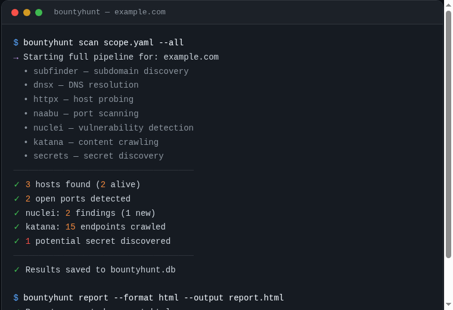
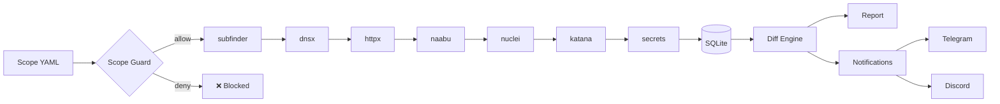

<p align="center">
  
  
  
  
  
  
</p>

<p align="center">
  <a href="#demo"></a>
  <a href="#quick-start"></a>
  <a href="#usage"></a>
  <a href="https://github.com/bess1lie/gqlhunter"></a>
</p>

<h1 align="center">Bountyhunt</h1>

<p align="center">
  <b>Scope-aware recon orchestration for bug bounty programs.</b><br>
  <i>Orchestrate · Monitor · Report — without leaving scope.</i>
</p>

<p align="center">
  
</p>

---

## Why Bountyhunt?

Running ProjectDiscovery tools individually works — until you need to answer:

| Question | Manual approach | With Bountyhunt |
|----------|----------------|-----------------|
| What changed since last week? | `diff` two terminal buffers | `bountyhunt monitor` |
| Did I scan something out of scope? | Hope you checked | Scope guard blocks it |
| Where is last month's scan data? | Hopefully in a text file | SQLite with full history |
| Can I share findings with the team? | Paste terminal output | HTML/Markdown report |

Bountyhunt is not a new scanner. It's an **orchestrator** that adds persistence, discipline, and accountability to the tools you already use.

> **Sister project:** [gqlhunter](https://github.com/bess1lie/gqlhunter) — GraphQL recon & analysis CLI.

---

## Architecture



| | | | |
|---|---|---|---|
| <b>91+</b><br>Tests | <b>8</b><br>Pipeline Stages | <b>7</b><br>Integrated Tools | <b>SQLite</b><br>Persistent Storage |

---

## Features

### 🛡 Scope Guard
Prevent accidental out-of-scope scanning. Every target is validated against a YAML allow/deny list before any tool runs.

### 🔄 Diff Monitoring
Track exactly what changed since the last scan. New hosts, open ports, findings, endpoints, or secrets — all delivered in a single digest.

### 💾 SQLite History
Every scan is persisted with timestamps. Full history of hosts, ports, findings, endpoints, and redacted secrets. Queryable, comparable, auditable.

### 📊 Reports
Generate clean Markdown or HTML reports via Jinja2. Include diff sections to show what changed. Ready to attach to bug bounty submissions.

### 📬 Notifications
Optional Telegram and Discord webhook alerts. First run establishes a silent baseline; subsequent runs notify only on changes.

### ⏯ Checkpoint / Resume
Interrupt a scan and resume from where you left off. No data loss, no redundant requests.

### 🐳 Docker
Multi-stage Docker build bundles all Go tools. `docker compose up -d` for a 6-hour recurring scan loop.

### 🧪 91 Automated Tests
1,600+ lines of test code covering every pipeline stage, scope rule, and edge case. CI enforces it on every commit.

---

## Use Cases

- **Weekly recon automation** — schedule `bountyhunt monitor` for continuous asset discovery
- **Bug bounty engagements** — stay in scope, generate submission-ready reports
- **Attack surface monitoring** — get alerted when new hosts or endpoints appear
- **Team collaboration** — share HTML reports with non-technical stakeholders

---

## Quick Start

### Prerequisites

- Python 3.11+
- Docker (recommended) or Go tools installed locally:
  [subfinder](https://github.com/projectdiscovery/subfinder) ·
  [dnsx](https://github.com/projectdiscovery/dnsx) ·
  [httpx](https://github.com/projectdiscovery/httpx) ·
  [naabu](https://github.com/projectdiscovery/naabu) ·
  [nuclei](https://github.com/projectdiscovery/nuclei) ·
  [katana](https://github.com/projectdiscovery/katana)

### Docker (recommended)

```bash
docker compose build
docker compose run --rm bountyhunt scan /data/scope.yaml --all
docker compose up -d   # monitoring loop (scans every 6h)
```

### From source

```bash
python -m venv .venv && source .venv/bin/activate
pip install .

bountyhunt init scope.yaml
bountyhunt scan scope.yaml --all
```

---

## Usage

### `bountyhunt init <scope.yaml>`
Create a template scope file.

### `bountyhunt scan <scope.yaml>`
Run the recon pipeline.

| Option | Default | Description |
|--------|---------|-------------|
| `--all`, `-a` | false | Full pipeline: recon + portscan + nuclei + content + secrets |
| `--target`, `-t` | None | Scan a specific target (overrides scope) |
| `--rate`, `-r` | 100 | Packets/sec for naabu port scan |
| `--severity`, `-s` | low,medium,high,critical | Nuclei severity filter |
| `--include-intrusive` | false | Enable dos/fuzz/intrusive templates |
| `--show-full-secrets` | false | Store raw secret values |
| `--no-resume` | false | Ignore checkpoints, start fresh |
| `--db` | bountyhunt.db | SQLite database path |

### `bountyhunt monitor <scope.yaml>`
Full scan + notifications on changes. First run is a silent baseline; subsequent runs send a digest of new findings via Telegram or Discord.

### `bountyhunt report`
Generate a report.

| Option | Default | Description |
|--------|---------|-------------|
| `--output`, `-o` | report.md | Output file |
| `--format`, `-f` | markdown | Report format (markdown or html) |
| `--target`, `-t` | None | Add diff section |
| `--db` | bountyhunt.db | SQLite database |

---

## Configuration

### scope.yaml

```yaml
allow:
  - "*.example.com"
  - "api.example.org"
deny:
  - "admin.example.com"
  - "*.internal.example.com"
```

### Environment

```bash
# Notifications (optional)
DISCORD_WEBHOOK_URL=https://discord.com/api/webhooks/...
TELEGRAM_BOT_TOKEN=...
TELEGRAM_CHAT_ID=...
```

See [.env.example](.env.example).

---

## Releases

### What's included in v1.1
- [x] Core recon pipeline (subfinder → dnsx → httpx)
- [x] Port scanning (naabu) + tech detection
- [x] Vulnerability scanning (nuclei) with safe defaults
- [x] Content crawling (katana) + secret discovery
- [x] Diff monitoring + Telegram / Discord notifications
- [x] HTML / Markdown reports with diff sections
- [x] Docker deployment (multi-stage, docker-compose)
- [x] Scan checkpoint / resume

### Next
- [ ] FastAPI live dashboard — real-time web UI
- [ ] Custom notification templates
- [ ] Batch mode — scan multiple scope files

---

## Ethics

> Designed exclusively for **authorized bug bounty programs**. Detection only — no exploitation.

---

<p align="center">Built for responsible security research. · <a href="LICENSE">MIT License</a> · <a href="https://github.com/bess1lie">bess1lie</a></p>
