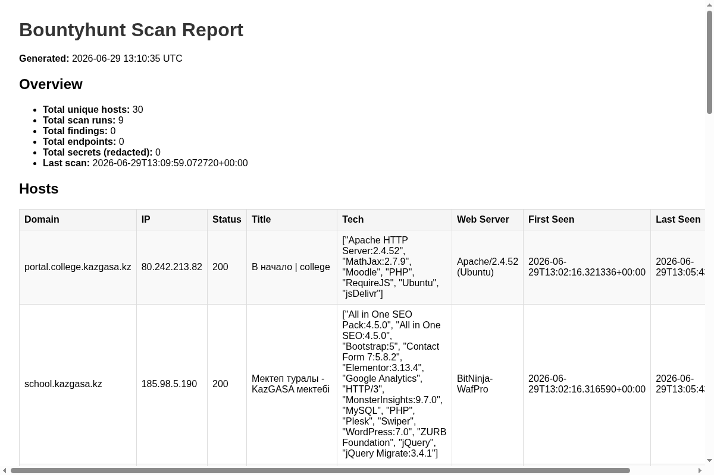

# Bountyhunt

[](https://github.com/bess1lie/bounthunt/actions/workflows/ci.yml)
[](https://github.com/bess1lie/bounthunt)
[](https://opensource.org/licenses/MIT)
[](https://www.python.org/downloads/)
[](https://github.com/bess1lie/bounthunt)
[](https://github.com/bess1lie/bounthunt)

> Automated recon and monitoring CLI for bug bounty programs.

> **Sister project:** [gqlhunter](https://github.com/bess1lie/gqlhunter) — GraphQL recon & analysis CLI.

---

## Quick example

```bash
# Full recon pipeline — one command
bountyhunt scan scope.yaml --all

# Monitor for changes (cron-ready)
bountyhunt monitor scope.yaml

# Generate HTML report with findings
bountyhunt report --format html --output report.html
```

---

## Demo

```text
$ bountyhunt scan scope.yaml --all
→ Starting full pipeline for: example.com
  • subfinder — subdomain discovery
  • dnsx — DNS resolution
  • httpx — host probing
  • naabu — port scanning
  • nuclei — vulnerability detection
  • katana — content crawling
  • secrets — secret discovery
────────────────────────────────────
✓ 3 hosts found (2 alive)
✓ 2 open ports detected
✓ nuclei: 2 findings (1 new)
✓ katana: 15 endpoints crawled
✓ 1 potential secret discovered
────────────────────────────────────
✓ Results saved to bountyhunt.db
```

**HTML Report Preview:**



[View sample HTML report](screenshots/report.html) · [View sample Markdown report](screenshots/report.md)

---

## Features

| Domain | Feature |
|--------|---------|
| 🔍 **Recon** | Subfinder → dnsx → httpx pipeline with scope validation |
| 🛡 **Scope Guard** | YAML allow/deny — no accidental out-of-scope scanning |
| 💾 **Storage** | Full SQLite history with timestamps, dedup, and redaction |
| 🔄 **Diff Monitoring** | Compare scans — see new hosts, ports, findings, secrets |
| 📬 **Notifications** | Telegram / Discord webhook alerts (optional) |
| 📊 **Reports** | Markdown & HTML via Jinja2 with diff sections |
| 🐳 **Docker** | Multi-stage build, docker-compose, cron-ready |
| ⏯ **Checkpoint/Resume** | Interrupt and resume scans without data loss |
| 🧪 **Tested** | 1600+ lines of tests across all modules |

---

## Why Bountyhunt?

Running `subfinder | dnsx | httpx | naabu | nuclei | katana` manually works — until you need to:

- **Track changes** — what's new since last week's scan?
- **Stay in scope** — one wrong domain and you've violated program rules
- **Store history** — finding disappeared? Check if it ever existed
- **Share results** — non-technical stakeholders need a report, not a terminal buffer

Bountyhunt solves all of this. It's not a new scanner — it's an **orchestrator** that adds persistence, discipline, and accountability to the tools you already use.

---

## Ethics & Disclaimer

> Bountyhunt is designed exclusively for **authorized bug bounty programs**. You must only scan targets explicitly listed in your scope file. The scope guard is a safety measure, not a legal shield.

- Always ensure you have written authorization before scanning any target.
- Respect rate limits and `Retry-After` headers.
- This tool performs **detection only** — no automatic exploitation.
- The author is not responsible for misuse of this tool.

---

## Quick Start

### Prerequisites

- Python 3.11+
- Go-based recon tools (installed automatically in Docker):
  - [subfinder](https://github.com/projectdiscovery/subfinder) · [dnsx](https://github.com/projectdiscovery/dnsx) · [httpx](https://github.com/projectdiscovery/httpx)
  - [naabu](https://github.com/projectdiscovery/naabu) · [nuclei](https://github.com/projectdiscovery/nuclei) · [katana](https://github.com/projectdiscovery/katana)

### Install from source

```bash
python -m venv .venv && source .venv/bin/activate
pip install .

bountyhunt init scope.yaml
# Edit scope.yaml with your targets, then:
bountyhunt scan scope.yaml --all
```

### Docker

```bash
docker compose build
docker compose run --rm bountyhunt scan /data/scope.yaml --all
# Or monitoring loop (scans every 6h):
docker compose up -d
```

---

## Usage

### `bountyhunt init <scope.yaml>`

Create a template scope file with allow/deny rules.

### `bountyhunt scan <scope.yaml>`

Run recon pipeline (subfinder → dnsx → httpx).

| Option | Default | Description |
|--------|---------|-------------|
| `--all`, `-a` | false | Full pipeline: recon + portscan + nuclei + content + secrets |
| `--target`, `-t` | None | Scan a specific target (overrides scope) |
| `--rate`, `-r` | 100 | Packets/sec for naabu port scan |
| `--severity`, `-s` | low,medium,high,critical | Nuclei severity filter |
| `--include-intrusive` | false | Enable dos/fuzz/intrusive nuclei templates |
| `--show-full-secrets` | false | Store raw secret values (use with caution) |
| `--no-resume` | false | Ignore existing checkpoints and start fresh |
| `--db` | bountyhunt.db | SQLite database path |

### `bountyhunt monitor <scope.yaml>`

Run full scan and send notifications for new findings (cron-ready).

Reads `DISCORD_WEBHOOK_URL`, `TELEGRAM_BOT_TOKEN`, and `TELEGRAM_CHAT_ID` from environment (see [.env.example](.env.example)).

First run establishes a silent baseline. Subsequent runs send a digest of new hosts, ports, findings, endpoints, and redacted secrets.

### `bountyhunt report`

Generate a Markdown or HTML report from scan results.

| Option | Default | Description |
|--------|---------|-------------|
| `--output`, `-o` | report.md | Output file path |
| `--format`, `-f` | markdown | Report format (markdown or html) |
| `--target`, `-t` | None | Add "Changes Since Last Scan" diff section |
| `--db` | bountyhunt.db | SQLite database path |

### `bountyhunt --version`

```text
bountyhunt v1.1.0 — by bess1lie
```

---

## Example scope.yaml

```yaml
allow:
  - "*.example.com"
  - "api.example.org"
  - "example.net"
deny:
  - "admin.example.com"
  - "*.internal.example.com"
  - "old.example.net"
```

---

## Roadmap

- [x] **Stage 1-8** — Core pipeline, scanning, monitoring, reports, Docker, checkpoint/resume
- [ ] **FastAPI live dashboard** — Real-time web UI with scan history and drill-down
- [ ] **Notification templates** — Customisable message formatting
- [ ] **Batch mode** — Scan multiple scope files in sequence

---

## Author

**bess1lie** — [GitHub](https://github.com/bess1lie)

## License

MIT — see [LICENSE](LICENSE).
