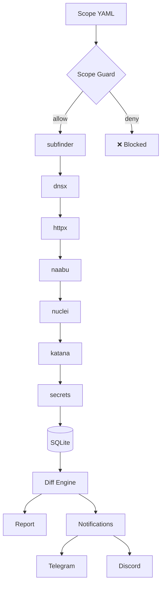

# 🎯 bounthunt — Bug Bounty Recon & Orchestration

[](https://pypi.org/project/bounthunt/)
[](https://pypi.org/project/bounthunt/)
[](https://opensource.org/licenses/MIT)
[](https://github.com/bess1lie/bounthunt/actions)
[](https://github.com/bess1lie/bounthunt)
[](https://github.com/psf/black)
[](http://mypy-lang.org/)
[](https://github.com/PyCQA/bandit)
[](https://github.com/bess1lie/bounthunt/stargazers)
[](https://github.com/bess1lie/bounthunt/issues)
[](https://github.com/bess1lie/bounthunt/pulls)

**Scope-aware recon orchestration for bug bounty programs.**

---

## 🚀 Demo

```bash
$ bounthunt monitor scope.yaml

🔄 Starting monitoring loop...
[INFO] Checking scope.yaml...
[INFO] Scan completed. 12 new hosts discovered.
[INFO] 2 new endpoints found on example.com
[INFO] 1 new vulnerability found via nuclei
[SUCCESS] Sending notification to Telegram...

$ bounthunt report --format html

📊 Generating diff report...
✅ Report saved to reports/diff_2026_07_12.html
```

---

## ❓ Why bounthunt?

| Question | Manual approach | With bounthunt |
| :--- | :--- | :--- |
| **What changed since last week?** | `diff` two terminal buffers | `bounthunt monitor` |
| **Did I scan out of scope?** | "Hope you checked" | Scope guard blocks it |
| **Where is my scan data?** | Scattered text files | SQLite with full history |
| **Can I share findings?** | Paste terminal output | Professional HTML/MD reports |

---

## ✨ Features

- **Scope Guard** — YAML allow/deny list prevents accidental out-of-scope scanning
- **Diff Monitoring** — Tracks new hosts, ports, findings, endpoints across scan runs
- **SQLite Persistence** — Every scan stored with timestamps, queryable and auditable
- **Professional Reports** — HTML/Markdown via Jinja2 with diff sections
- **Smart Notifications** — Telegram and Discord webhook alerts on changes
- **Dockerized Workflow** — Multi-stage Docker build, `docker compose up -d` for 24/7 scans

## 🛠️ Built With

- **Language:** Python 3.11+
- **Orchestration:** subfinder · dnsx · httpx · naabu · nuclei · katana
- **Database:** SQLite
- **Reports:** Jinja2
- **Notifications:** Telegram / Discord webhooks
- **Deployment:** Docker

---

## 🏗️ Architecture



---

## ⚡ Quick Start

### Prerequisites
- Python 3.11+
- Docker (recommended) or Go tools installed locally

### Using Docker (Recommended)
```bash
docker compose build
docker compose run --rm bounthunt scan /data/scope.yaml --all
docker compose up -d
```

### Using Source
```bash
git clone https://github.com/bess1lie/bounthunt.git
cd bounthunt
pip install .
bounthunt init scope.yaml
bounthunt scan scope.yaml --all
```

---

## 🗺️ Roadmap

| Feature | Status |
| :--- | :--- |
| Core Recon Pipeline | ✅ |
| Scope Guard & Diff Engine | ✅ |
| SQLite Persistence | ✅ |
| Docker Deployment | ✅ |
| Real-time Web Dashboard | 🚧 In Progress |
| Custom Notification Templates | 🔮 Planned |

---

## 🤝 Contributing

Contributions welcome! See [CONTRIBUTING.md](CONTRIBUTING.md).

## 📄 License

MIT — see [LICENSE](LICENSE).

---

<p align="center">
  <a href="https://github.com/bess1lie/apihunter">🔍 apihunter</a> ·
  <a href="https://github.com/bess1lie/gqlhunter">🚀 gqlhunter</a> ·
  <a href="https://bess1lie.github.io">🌍 bess1lie.github.io</a>
</p>
