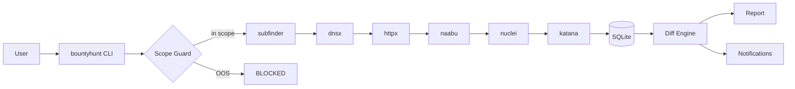

# 🏴 Bountyhunt

[](https://github.com/bess1lie/bounthunt/actions/workflows/ci.yml)
[](https://opensource.org/licenses/MIT)
[](https://www.python.org/downloads/)
[](tests/)
[](https://github.com/bess1lie/bounthunt/commits/main)
[](https://github.com/bess1lie/bounthunt)

> Automated recon & monitoring CLI for bug bounty programs.

> **Sister project:** [gqlhunter](https://github.com/bess1lie/gqlhunter) — GraphQL recon & analysis CLI.

---

## Why Bountyhunt?

Running subfinder, dnsx, httpx, naabu, nuclei, katana **manually** every day is tedious.
Bountyhunt chains them into one command, stores everything in SQLite, and tells you
**what changed** since the last scan — no more comparing terminal dumps.

```
before: 6 tools × N targets × daily = hours of manual work
after:  bountyhunt scan scope.yaml --all → done in one command
```

---

## Demo

```bash
$ bountyhunt scan scope.yaml --all

→ Starting full pipeline for: example.com
  • subfinder → 12 subdomains
  • dnsx → 8 resolved
  • httpx → 5 alive (200/30x)
  • naabu → 3 open ports
  • nuclei → 2 findings (1 new)
  • katana → 15 endpoints (3 new)
  • secrets → 1 potential secret (1 new)
✓ Results saved to bountyhunt.db

$ bountyhunt report --output report.html --format html
✓ Report generated: report.html

$ bountyhunt monitor scope.yaml
  (first run: silent baseline)
  (second run: digests of new changes via Telegram/Discord)
```

---

## Features

- **Orchestration pipeline** — subfinder → dnsx → httpx → naabu → nuclei →
  content discovery, all in one command
- **Scope guard** — every active scan is validated against a YAML allow/deny
  list
- **SQLite storage** — full history of findings with timestamps
- **Checkpoint/resume** — interrupted scans pick up where they left off
- **Diff monitoring** — see exactly what changed since the last scan
- **Notifications** — Telegram/Discord webhook alerts for new findings
- **Reports** — Markdown/HTML report generation with Jinja2

## Architecture



## Ethics & Disclaimer

> **Important:** Bountyhunt is designed exclusively for **authorized bug bounty
> programs**. You must only scan targets explicitly listed in your scope file.
> The scope guard is a safety measure, not a legal shield.

- Always ensure you have written authorization before scanning any target.
- Respect rate limits and `Retry-After` headers.
- This tool performs **detection only** — no automatic exploitation.
- The author is not responsible for misuse of this tool.

## Quick Start

### Prerequisites

- Python 3.11+
- Go-based recon tools (installed automatically in Docker):
  - [subfinder](https://github.com/projectdiscovery/subfinder)
  - [dnsx](https://github.com/projectdiscovery/dnsx)
  - [httpx](https://github.com/projectdiscovery/httpx)
  - [naabu](https://github.com/projectdiscovery/naabu)
  - [nuclei](https://github.com/projectdiscovery/nuclei)
  - [katana](https://github.com/projectdiscovery/katana)

### Install from source

```bash
# Create and activate a virtual environment (recommended)
python -m venv .venv
source .venv/bin/activate

# Install Python package
pip install .

# Initialise a scope file
bountyhunt init scope.yaml

# Edit scope.yaml with your targets, then run a full scan
bountyhunt scan scope.yaml --all
```

### Docker

```bash
# Build the image (includes all Go tools)
docker compose build

# Run an ad-hoc scan
docker compose run --rm bountyhunt scan /data/scope.yaml --all

# Or run in monitoring loop (scans every 6h)
docker compose up -d
```

See [docker-compose.yml](docker-compose.yml) for volume mount details.

## Usage

### `bountyhunt init <scope.yaml>`

Create a template scope file with allow/deny rules.

### `bountyhunt scan <scope.yaml>`

Run recon pipeline (subfinder → dnsx → httpx).

| Option | Default | Description |
|--------|---------|-------------|
| `--all`, `-a` | false | Full pipeline: recon + portscan + nuclei + content + secrets |
| `--target`, `-t` | None | Scan a specific target (overrides scope) |
| `--rate`, `-r` | 100 | Packets/sec for naabu port scan |
| `--severity`, `-s` | low,medium,high,critical | Nuclei severity filter |
| `--include-intrusive` | false | Enable dos/fuzz/intrusive nuclei templates |
| `--show-full-secrets` | false | Store raw secret values (use with caution) |
| `--no-resume` | false | Ignore existing checkpoints and start fresh |
| `--db` | bountyhunt.db | SQLite database path |

### `bountyhunt monitor <scope.yaml>`

Run full scan and send notifications for new findings (cron-ready).

Reads `DISCORD_WEBHOOK_URL`, `TELEGRAM_BOT_TOKEN`, and `TELEGRAM_CHAT_ID`
from environment (see [.env.example](.env.example)).

First run establishes a silent baseline. Subsequent runs send a digest
of new hosts, ports, findings, endpoints, and redacted secrets.

### `bountyhunt report`

Generate a Markdown or HTML report from scan results.

| Option | Default | Description |
|--------|---------|-------------|
| `--output`, `-o` | report.md | Output file path |
| `--format`, `-f` | markdown | Report format (markdown or html) |
| `--target`, `-t` | None | Add "Changes Since Last Scan" diff section |
| `--db` | bountyhunt.db | SQLite database path |

### `bountyhunt --version`

```text
bountyhunt v1.1.0 — by bess1lie
```

## Example scope.yaml

```yaml
allow:
  - "*.example.com"
  - "api.example.org"
  - "example.net"
deny:
  - "admin.example.com"
  - "*.internal.example.com"
  - "old.example.net"
```

## Roadmap

- [x] **Stage 1** — Core: scope guard, DB, runner, recon pipeline (subfinder → dnsx → httpx)
- [x] **Stage 2** — Port scanning (naabu), tech detection, httpx port probing
- [x] **Stage 3** — Vulnerability scanning (nuclei) with safe defaults and dedup
- [x] **Stage 4** — Content crawling (katana), secret discovery with redaction
- [x] **Stage 5** — Diff-based monitoring, Telegram/Discord notifications, first-run baseline
- [x] **Stage 6** — Static reports with diff section (HTML/Markdown)
- [x] **Stage 7** — Docker deployment (multi-stage build, docker-compose)
- [x] **Stage 8** — Scan checkpoint/resume (`--no-resume`) with SQLite-based state tracking
- [ ] **FastAPI live dashboard** *(planned)* — Real-time web UI with scan history,
      per-target filtering, and drill-down into findings and secrets
- [ ] **Notification templates** *(planned)* — Customisable message formatting

## Author

**bess1lie** — [GitHub](https://github.com/bess1lie)

## License

MIT — see [LICENSE](LICENSE).
